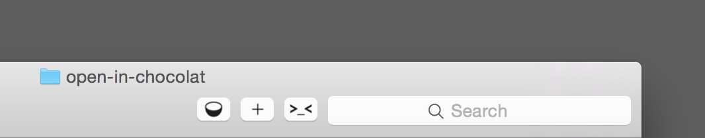

# Open in Chocolat

I'm a huge fan of the [Chocolat text editor](http://chocolatapp.com). 'Open in Chocolat' is a miniapp that lives in your Finder toolbar and works in four ways:

1. With one or more files selected, clicking the button opens those files.
2. With a folder selected, clicking the button opens all the files in that folder.
3. With no files selected, clicking the button opens all the files in the folder associated with the window.
4. Dragging files or folders to the button opens the dragged items.

## Installation

Download the zip, extract, and put the 'Open in Chocolat' in your Applications folder. Then Command-drag it to your Finder toolbar.
Also included in the zip is the source applescript file that was compiled to build the app

## Thanks / Credits

The code for this was simply adapted from Dr. Drang's [Open in BBEdit](http://www.leancrew.com/all-this/2012/09/bbedit-finder-toolbar-icon/) version. The icon was adapted from Chocolat itself.

**Hope you find this as useful as I do!**
